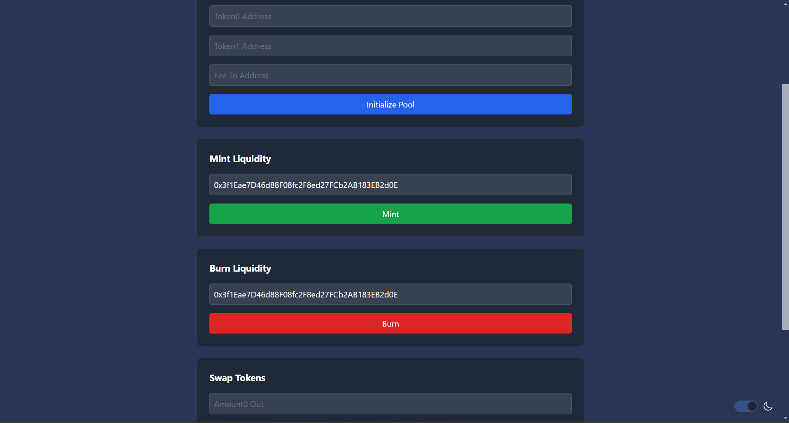
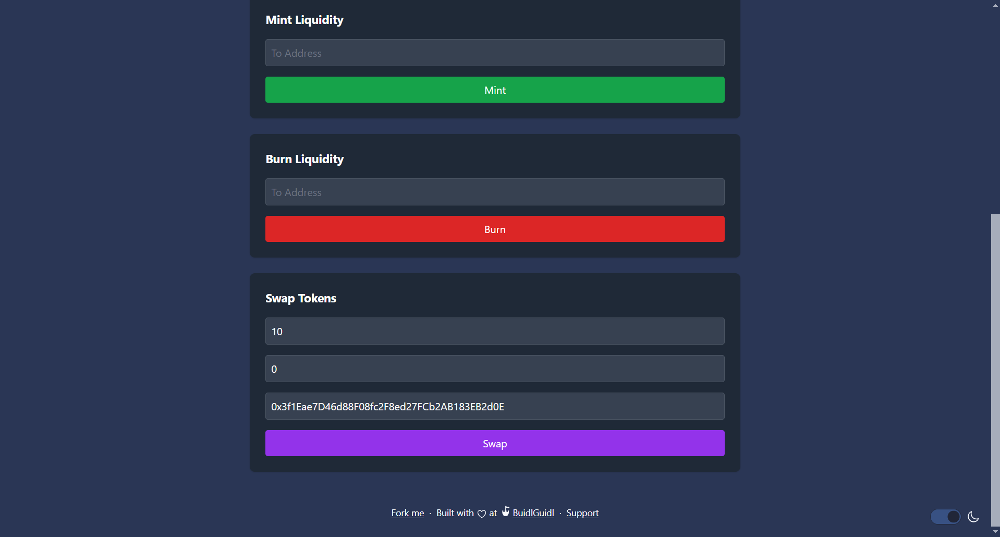

# 🚩 Challenge #4: 🔄 Uniswap V2-Stylus 

🎫 Build a Uniswap V2-style liquidity pool interface with Arbitrum Stylus:

👷‍♀️ In this challenge, you'll build and deploy smart contracts that enable users to interact with a Uniswap V2-style liquidity pool. You'll work with token pairs, implement liquidity management functions, and create a frontend that allows users to perform various pool operations! 🚀

🌟 The final deliverable is a full-stack application featuring token pair initialization, liquidity management, token swaps, and allowance management. Deploy your contracts to a testnet, then build and upload your app to a public web server.

## Checkpoint 0: 📦 Environment Setup 📚

Before starting, ensure you have the following installed:

- [Node.js (>= v18.17)](https://nodejs.org/en/download/)
- [Yarn](https://classic.yarnpkg.com/en/docs/install/)
- [Git](https://git-scm.com/downloads)
- [Docker Desktop](https://www.docker.com/products/docker-desktop)

### Clone the Repository

```bash
git clone https://github.com/abhi152003/speedrun-rust.git
cd speedrun-rust
git checkout stylus-uniswap
```

## Checkpoint 1: 🚀 Start Your Dev Environment

### Step 1: Start the Nitro Dev Node

1. Navigate to the `cargo-stylus` folder:
   ```bash
   cd packages/cargo-stylus/stylus-uniswap-v2
   ```

2. Run the `run-dev-node.sh` script:
   ```bash
   bash run-dev-node.sh
   ```
   This script:
   - Spins up an Arbitrum Stylus Nitro dev node in Docker.
   - Deploys the contract.
   - Generates the ABI for interacting with the contract.

> The dev node will be accessible at `http://localhost:8547`.

### Step 2: Start the Frontend

1. Navigate to the `nextjs` folder:
   ```bash
   cd ../../nextjs
   ```

2. Install dependencies:
   ```bash
   yarn install
   ```

3. Start the development server:
   ```bash
   yarn dev
   ```

> The app will be available at [http://localhost:3000](http://localhost:3000) as shown below.


## Checkpoint 2: 💫 Explore the Features

### 1. Pool Initialization


*Pool initialization interface and process flow*

- Navigate to the "Liquidity Operations" tab in the frontend.
- This feature interacts with the Pool Initializer contract.
- Required inputs:
  ```
  Token0 Address: 0x5FbDB2315678afecb367f032d93F642f64180aa3
  Token1 Address: 0xe7f1725E7734CE288F8367e1Bb143E90bb3F0512
  FeeTo Address:  0x3f1Eae7D46d88F08fc2F8ed27FCb2AB183EB2d0E
  ```
- Click "Initialize Pool" to create a new liquidity pool for the token pair.
- The transaction will require a gas limit of 10,000,000.

### 2. Liquidity Management


*Liquidity management interface and process flow*

#### Add Liquidity (Mint)
- Navigate to the "Liquidity Operations" tab
- Under "Mint Liquidity" section:
  1. Enter the recipient address in the "To Address" field (e.g. 0x3f1Eae7D46d88F08fc2F8ed27FCb2AB183EB2d0E)
  2. Click "Mint" to add liquidity
  3. The transaction will require a gas limit of 10,000,000

#### Remove Liquidity (Burn)
- In the same tab, find the "Burn Liquidity" section:
  1. Enter the recipient address for withdrawn tokens (e.g. 0x3f1Eae7D46d88F08fc2F8ed27FCb2AB183EB2d0E)
  2. Click "Burn" to remove liquidity
  3. The transaction will require a gas limit of 10,000,000

### 3. Token Swaps


*Token swap interface and process flow*

- In the "Liquidity Operations" tab, locate the "Swap Tokens" section:
  1. Enter Amount0 Out (amount of first token to receive)
  2. Enter Amount1 Out (amount of second token to receive)
  3. Specify recipient address in the "To Address" field (e.g. 0x3f1Eae7D46d88F08fc2F8ed27FCb2AB183EB2d0E)
  4. Note: One of the amounts must be zero
  5. Click "Swap" to execute the token swap
  6. The transaction will require a gas limit of 10,000,000

### 4. Token Transfers and Allowances


*Token transfers interface and process flow*
#### Token Transfers
- Navigate to the "Token Transfers" tab:
  1. Use "Transfer Tokens" to send tokens directly:
     - Enter recipient address (e.g. 0x3f1Eae7D46d88F08fc2F8ed27FCb2AB183EB2d0E)
     - Specify amount to transfer
     - Click "Transfer"
  2. Use "Transfer From" for approved transfers:
     - Enter source address (e.g. 0xa6e41ffd769491a42a6e5ce453259b93983a22ef)
     - Enter recipient address (e.g. 0x3f1Eae7D46d88F08fc2F8ed27FCb2AB183EB2d0E)
     - Specify amount
     - Click "Transfer From"
  3. Check balances:
     - Enter address to check (e.g. 0x3f1Eae7D46d88F08fc2F8ed27FCb2AB183EB2d0E)
     - Click "Check Balance"
     - View balance in the results section

#### Allowance Management


*Allowances interface and process flow*
- Navigate to the "Allowances" tab:
  1. Approve spending:
     - Enter spender's address (e.g. 0xa6e41ffd769491a42a6e5ce453259b93983a22ef)
     - Specify amount to approve
     - Click "Approve"
  2. Check allowances:
     - Enter owner's address (e.g. 0x3f1Eae7D46d88F08fc2F8ed27FCb2AB183EB2d0E)
     - Enter spender's address (e.g. 0xa6e41ffd769491a42a6e5ce453259b93983a22ef)
     - Click "Check Allowance"
     - View allowance in the results section

## Checkpoint 3: 🛠 Modify and Deploy Contracts

You can modify the contract logic by editing files in the `packages/cargo-stylus/src` folder. After making changes, redeploy by running:

```bash
bash run-dev-node.sh
```

## 🛠️ Debugging Tips

### Fixing Line Endings for Shell Scripts on Windows (CRLF Issue)

If you encounter errors like `Command not found`, convert line endings to LF:

```bash
sudo apt install dos2unix
dos2unix run-dev-node.sh
chmod +x run-dev-node.sh
```

Run the script again:
```bash
bash run-dev-node.sh
```

### Common Issues:
1. Connection Error: If you see "Failed to initialize contract":
   - Ensure the Nitro dev node is running at http://localhost:8547
   - Check if the contract address matches your deployed contract

2. Transaction Errors:
   - Ensure you have sufficient balance for gas fees
   - Check that input addresses are valid Ethereum addresses
   - Verify that token amounts are properly formatted

## Checkpoint 4: 🚢 Ship your frontend! 🚁

To deploy your app to Vercel:

```bash
yarn vercel
```

Follow Vercel's instructions to get a public URL.

For production deployment:
```bash
yarn vercel --prod
```

## Checkpoint 5: 📜 Contract Verification

You can verify your deployed smart contract using:

```bash
cargo stylus verify -e http://127.0.0.1:8547 --deployment-tx "$deployment_tx"
```

Replace `$deployment_tx` with your deployment transaction hash.

## 🏁 Next Steps

1. Add more token pairs to your liquidity pool
2. Implement additional features like:
   - Flash swaps
   - Price oracles
   - Fee management
3. Enhance the frontend with:
   - Price charts
   - Transaction history
   - Portfolio tracking

Explore more challenges or contribute to this project!